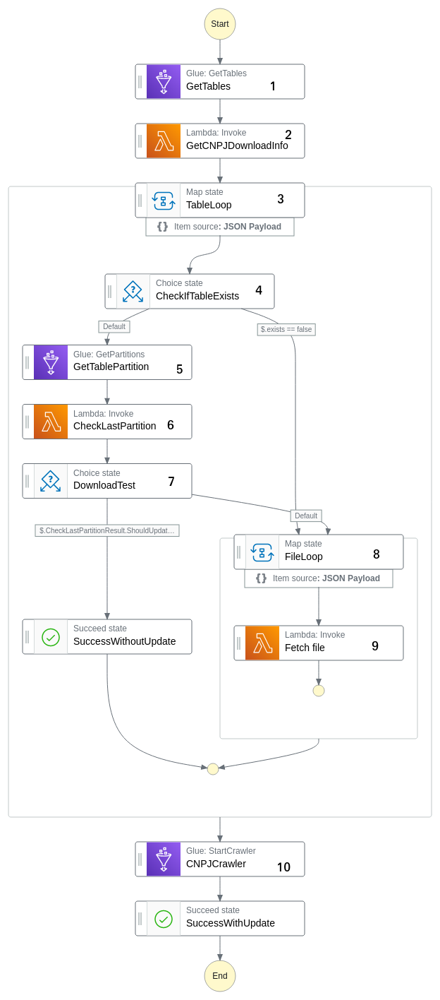

# ETL com AWS Step Functions - Dados Públicos CNPJ

Este projeto mostra como utilizar os serviços da Amazon Web Services (AWS) para construir um pipeline de extração de dados. O objetivo é capturar os dados do Cadastro Nacional de Pessoas Jurídicas (CNPJ) disponibilizado pela Receita Federal em seu site. Em particular, trabalharei com a tabela Empresas. A lista abaixo mostra os serviços da AWS empregados. Uma característica em comum é que são serverless e totalmente gerenciados. Ou seja, só precisei me preocupar com o código, e não com a infraestrutura. 

- AWS Lambda: executa funções Python.
- AWS Step Functions: uma máquina de estados que orquestra os outros serviços AWS utilizados.
- Amazon S3: object storage para guardar os arquivos de dados.
- AWS Glue Data Catalog: repositório de metadados das tabelas.
- Amazon EventBridge Scheduler: ferramenta para agendar a execução da máquina de estados.

## Pré-requisitos

- Ter uma conta AWS. Acho que todos os serviços deste projeto se enquadram no nível gratuito para contas novas. Porém, se sua conta já for antiga, a boa notícia é que precisaremos gastar menos de US$ 0,2 para fazer os testes. O resposável pelo maior custo será o Crawler do Data Catalog.
- Conhecimentos básicos de AWS e do console.

## Desenho da solução

A solução é baseada em uma máquina de estados para orquestrar as chamadas dos lambdas e da API do AWS Glue. Ela será executada semanalmente com o auxílio do Amazon EventBridge. Em linhas gerais, seguimos o seguinte fluxo:

1. Coletamos a data da último atualização da tabela Empresas no site da Receita. 
2. Coletamos a lista de tabelas criadas no nosso database do Data Catalog.
3. Verificamos a tabela já existe. Se sim, seguimos para o próximo passo. Se não, seguimos para o passo 4.
4. Coletamos as partições da tabela e rodamos uma lambda para verificar se devemos ou não ingerir um novo batch na tabela. Se não, o pipeline se encerra aqui. Se sim, seguimos para o próximo passo.
5. Executamos 10 vezes em paralelo uma função que irá baixar um dos arquivos da tabela e guardá-lo na "pasta" correta do bucket S3.
6. Finalmente rodamos um Crawler do AWS Glue para descobrir a nova partição e agregá-la aos metadados das tabela.

## Referências

- https://github.com/aphonsoar/Receita_Federal_do_Brasil_-_Dados_Publicos_CNPJ
