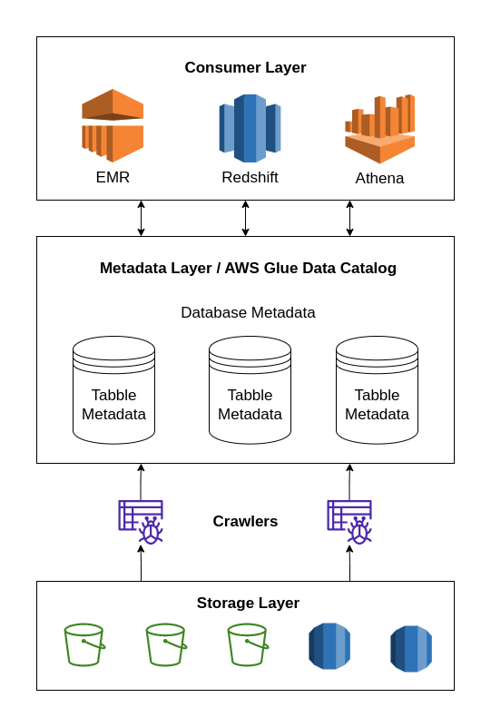
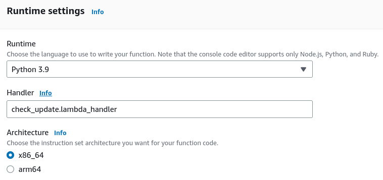

# ETL com AWS Step Functions - Dados Públicos CNPJ

Este projeto mostra como utilizar os serviços da [Amazon Web Services (AWS)](https://aws.amazon.com/pt/?nc2=h_lg) para construir um pipeline de extração de dados. O objetivo é capturar os [dados do Cadastro Nacional de Pessoas Jurídicas (CNPJ)](https://dados.gov.br/dados/conjuntos-dados/cadastro-nacional-da-pessoa-juridica---cnpj) disponibilizado pela Receita Federal (RF) em [seu site](https://dadosabertos.rfb.gov.br/CNPJ/). Em particular, trabalhei com a tabela Empresas. A lista abaixo mostra os serviços da AWS empregados. Uma característica em comum é que são serverless e totalmente gerenciados. Ou seja, só precisei me preocupar com o código, e não com a infraestrutura. 

- AWS Lambda: executa funções Python.
- AWS Step Functions: uma máquina de estados que orquestra os outros serviços AWS utilizados.
- Amazon S3: object storage para guardar os arquivos de dados.
- AWS Glue Data Catalog: repositório de metadados das tabelas.
- Amazon EventBridge Scheduler: ferramenta para agendar a execução da máquina de estados.

## Pré-requisitos

- Ter uma conta AWS. Acho que todos os serviços deste projeto se enquadram no [nível gratuito](https://aws.amazon.com/pt/free/?nc2=h_ql_pr_ft&all-free-tier.sort-by=item.additionalFields.SortRank&all-free-tier.sort-order=asc&awsf.Free%20Tier%20Types=*all&awsf.Free%20Tier%20Categories=*all) para contas novas. Porém, se sua conta já for antiga, a boa notícia é que precisei gastar menos de US$ 0,20 para fazer os testes. O resposável pelo maior custo foi o Crawler do Data Catalog.
- Conhecimentos básicos de AWS e do console.
- Ter o Python 3.9 instalado na sua máquina.
- Ter conhecimentos básicos de engenharia de dados.

## Serviços de dados e analytics na AWS

Antes de entrar em detalhes de cada serviço, vale a pena explicar como funciona a integração entre os serviços de dados e analytics da AWS.



Na AWS cada serviço cuida de uma parte da implantação de um *datalake*. Assim, há uma divisão clara entre os serviços que armazenam, catalogam e consumem dados.

Na base do diagrama temos os serviços de armazenamento, como Amazon S3 e Amazon RDS. É neles onde os dados efetivamente moram. Repare que cada serviço tem suas especificidades, podendo guardar ou não metadados de dados estruturados, semi-estruturados ou não estruturados.

Em seguida, temos o AWS Glue Data Catalog, cujo objetivo é catalogar os metadados de várias fontes de informação em um local único e de forma padronizada. Para isso utilizamos Crawlers que examinam as fontes de dados para catalogar tabelas, particionamentos, tipos de dados, formatos de arquivo, etc. 

Por último existem os serviços de consumo, como EMR (cluster hadoop), Redshift e Athena. 

Neste projeto trabalhei apenas nas duas primeiras camadas. Primeiro construimos as ferramentas para guardar os dados em um bucket S3. Depois utilizaremos um crawler para catalogar os metadados da tabela Empresas em um database do Data Catalog da nossa conta.

## Desenho da solução


A solução é baseada em uma máquina de estados para orquestrar as chamadas dos lambdas e da API do AWS Glue. Ela será executada semanalmente com o auxílio do Amazon EventBridge. Em linhas gerais, sigo o seguinte fluxo:

1. Coleto a data da último atualização da tabela Empresas no site da Receita. 
2. Coleto a lista de tabelas criadas no database `cnpj` do Data Catalog.
3. Verifico se a tabela já existe. Se sim, sigo para o próximo passo. Se não, sigo para o passo 5.
4. Coleto as partições da tabela e rodo uma lambda para verificar se devo ou não ingerir um novo batch na tabela. Se não, o pipeline se encerra aqui. Se sim, sigo para o próximo passo.
5. Executo 10 vezes em paralelo uma função que irá baixar um dos arquivos da tabela e guardá-la na "pasta" correta do bucket S3.
6. Finalmente rodo um Crawler do AWS Glue para descobrir a nova partição e agregá-la aos metadados da tabela.

## Implementação

Utilizei a região N. Virginia (us-east-1) pois é a mais barata e a latência neste projeto é irrelevante.

### S3

Será necessário um bucket S3 cuja estrutura será dada pelo diagrama abaixo.

```
.
└── cnpj-procet/
    └── cnpj_db/
        └── empresas/
            ├── ref_date=20230416/
            │   ├── file1
            │   ├── file2
            │   ├── ...
            │   └── fileN
            └── ref_date=20230516/
                ├── file1
                ├── file2
                ├── ...
                └── fileN
```

Note que usamos "pastas" para representar e separar databases, tabelas e partições. A princípio nenhuma pasta precisa ser criada pois isso será feito automaticamente pela Lambda `fetch_data`.

### AWS Glue

No Glue será necessário criar um database e um Crawler. A criação do database é super simples pelo console, bastando apenas passar um nome. Na criação do Crawler preste atenção nas seguinte configurações:

- Configure uma fonte de dados originada do bucket S3 que criamos anteriormente. A localização sobre a qual o crawler atuará será `s3://nome_do_seu_bucket/cnpj_db/empresas/`. Ou seja, ele servirá apenas para varrer a tabela empresas.
- Nas configurações de saída use o database criado anteriomente.
- Use a IAM Role criada anteriormente `CNPJCrawlerRole`.
- No agendamento do Crawler selecionar sob-demanda.

### Lambdas

O AWS Lambda é um serviço que tenta abstrair ao máximo a execução de uma função. [Esta documentação](https://docs.aws.amazon.com/lambda/latest/dg/welcome.html) explica de forma resumida e completa o que é ele faz, como ele pode ser disparado, quais as suas capacidades, etc.

Neste projeto usei três funções que rodam em ambiente Python 3.9: `check_update`, `fetch_data` e `download_test`. O código está organizado na pasta `lambdas`. A pasta de cada lambda contém:

1. O código que de fato será executado.
2. O arquivo `requirements.txt`, que lista as dependências da função.
3. Um bash script para gerar o *deployment package*.

Cada bash script deve ser rodado a partir da pasta onde está contidos. Ele faz o seguinte:

1. Cria um virtual env.
2. Instala as dependências.
3. Cria o arquivo .zip com o código da função e das dependências.

Os arquivos zip devem ser subidos no console da AWS.

Utilizei as seguintes IAM Roles para cada lambda:

| Nome          | Role             |
|---------------|------------------|
| check_update  | SimpleLambdaRole |
| fetch_data    | LambdaRoleWithS3 |
| download_test | SimpleLambdaRole |

#### check_update

Esta função não tem input. Ela faz um web scraping simples para extrair a data de alteração dos arquivos da tabela Empresas no [site da Receita Federal](https://dadosabertos.rfb.gov.br/CNPJ/).

Analisando o código-fonte da página, percebe-se que é simplesmente uma tabela HTML. Portanto, eu utilizo o pacote `beautifulsoup` para tratar a tabela, encontrar a linha correspondente ao arquivo `Empresas0.zip` e extrair a sua data de alteração. É esta data que será passada adiante no pipeline. O retorno da função será um dicionário neste formato:

```json
{
  "statusCode": 200,
  "body": {"ref_date": 20230416}
}
```

Conforme descrito acima, o *deployment package* desta função deve ser construído e subido na AWS. Na criação da lambda recomendo alterar as seguintes propriedades:

- Timeout igual a 15s. As vezes a requisição ao site da RF demora.
- Atualizar o nome do arquivo no Handler.



#### download_test

Esta função recebe um JSON semelhante ao exposto abaixo, o qual é gerado durante a execução da máquina de estados.

```json
{
  "LambdaResult": {
    "ref_date": 20230315
  },
  "Tables": {
    "TableList": [
      
    ]
  },
  "partitionValues": {
    "partitionValues": [
      [
        "20230315"
      ]
    ]
  }
}
```

Ela faz uma comparação de datas para verificar se devemos atualizar a tabela com os dados disponibilizados no site da RF. Como `$.partitionValues.partitionValues` é um array, primeiro eu encontro o valor máximo da lista e só depois faço a comparação com o `$.LambdaResult.ref_date`.

O retorno terá o seguinte formato:

```json
{
  "statusCode": 200,
  "body": false
}
```

Como esta função não tem dependências, não é necessário criar o *deployment package*. Após criar a lambda, o código pode ser simplesmente colado no editor de texto do console.

#### fetch_data

Esta função faz o download, tratamento e armazenamento dos arquivos da tabela Empresas. Cada chamada trata um dos arquivos individualmente e deve receber um *payload* semelhante ao abaixo:

```json
{
  "url": "https://dadosabertos.rfb.gov.br/CNPJ/Empresas0.zip",
  "table_name": "empresas",
  "date": "20230416"
}
```

Em linhas gerais, a função faz o seguinte:

1. Usa o pacote `urllib` para baixar o arquivo cujo link foi passado no payload. Este arquivo é salvo no disco efêmero do lambda, localizado na pasta `/tmp/`. 
2. O arquivo .zip é extraído e o CSV é armazenado em `/tmp/`.
3. O CSV é convertido em Parquet usando o pacote `pyarrow`.
4. O Parquet é enviado ao bucket S3 dentro da estrutura de "pastas" pré-definida para receber os arquivos das tabelas.

Conforme descrito acima, o *deployment package* desta função deve ser construído e subido na AWS. Devido ao tamanho dos arquivos manipulados, na criação da lambda recomendo alterar as seguintes propriedades:

- Atualizar o nome do arquivo no Handler.
- Limite de memória RAM: 3008 MB.
- Limite de armazenamento efêmero: 2048 MB.
- Timeout: 8 min.

### Máquina de estados

...

### IAM Roles

...

## Referências

- https://github.com/aphonsoar/Receita_Federal_do_Brasil_-_Dados_Publicos_CNPJ
