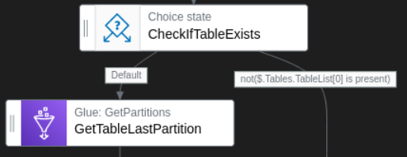
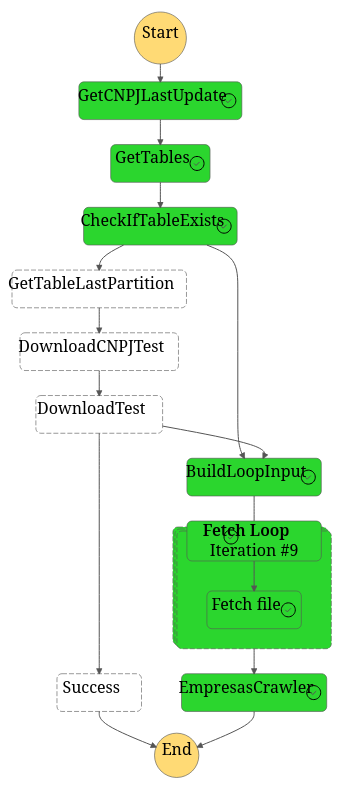
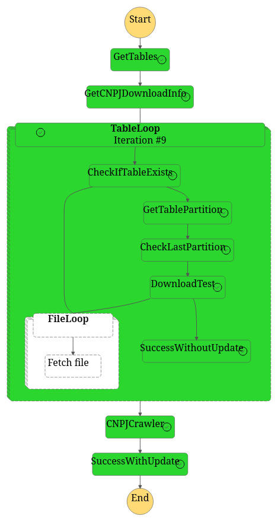

# ETL com AWS Step Functions - Dados Públicos CNPJ

- [ETL com AWS Step Functions - Dados Públicos CNPJ](#etl-com-aws-step-functions---dados-públicos-cnpj)
  - [Pré-requisitos](#pré-requisitos)
  - [Serviços de dados e analytics na AWS](#serviços-de-dados-e-analytics-na-aws)
  - [Desenho da solução](#desenho-da-solução)
  - [Detalhes de cada componente](#detalhes-de-cada-componente)
    - [IAM Roles](#iam-roles)
    - [S3](#s3)
    - [AWS Glue](#aws-glue)
    - [Lambdas](#lambdas)
      - [check\_update](#check_update)
      - [download\_test](#download_test)
      - [fetch\_data](#fetch_data)
    - [Step Functions](#step-functions)
      - [Descrição detalhada da máquina](#descrição-detalhada-da-máquina)
    - [EventBridge Scheduler](#eventbridge-scheduler)
  - [Implementação](#implementação)
  - [Referências](#referências)

Este projeto mostra como utilizar os serviços da [Amazon Web Services (AWS)](https://aws.amazon.com/pt/?nc2=h_lg) para construir um *pipeline* de extração de dados. O objetivo é capturar os [dados do Cadastro Nacional de Pessoas Jurídicas (CNPJ)](https://dados.gov.br/dados/conjuntos-dados/cadastro-nacional-da-pessoa-juridica---cnpj) disponibilizado pela Receita Federal (RF) em [seu site](https://dadosabertos.rfb.gov.br/CNPJ/). Mais especificamente, extrairemos as seguintes tabelas:

- Empresas
- Sócios
- Estabelecimentos
- Simples
- Municípios
- CNAEs
- Naturezas jurídicas
- Motivos
- Países
- Qualificações

Para isso utilizaremos os seguintes serviços: 

- AWS Lambda: executa funções Python.
- AWS Step Functions: uma máquina de estados que orquestra os outros serviços AWS utilizados.
- Amazon S3: object storage para guardar os arquivos de dados.
- AWS Glue Data Catalog: repositório de metadados das tabelas.
- Amazon EventBridge Scheduler: ferramenta para agendar a execução da máquina de estados.
- AWS CloudFormation: deploy automático de infraestrutura por meio de um template YAML.

Uma característica em comum é que são serverless e totalmente gerenciados. Ou seja, só é necessário se preocupar com o código, e não com a infraestrutura.

## Pré-requisitos

- Ter Python 3.9 instalado na sua máquina.
- Ter uma conta AWS. Todos os serviços deste tutorial se enquadram no [nível gratuito](https://aws.amazon.com/pt/free/?nc2=h_ql_pr_ft&all-free-tier.sort-by=item.additionalFields.SortRank&all-free-tier.sort-order=asc&awsf.Free%20Tier%20Types=*all&awsf.Free%20Tier%20Categories=*all) para contas novas. Porém, se sua conta já for antiga, a boa notícia é que precisei gastar menos de US$ 0,20 para fazer os testes.
- Conhecimentos básicos de AWS.
- Conhecimentos básicos de engenharia de dados.

## Serviços de dados e analytics na AWS

Antes de entrar em detalhes de cada serviço, vale a pena explicar como funciona a integração entre os serviços de dados e analytics da AWS.


Na AWS cada serviço cuida de uma parte da implantação de um *datalake*. Assim, há uma divisão clara entre os serviços que armazenam, catalogam e consumem dados.

Na base do diagrama temos os serviços de armazenamento, como Amazon S3 e Amazon RDS. É neles onde os dados efetivamente moram. Repare que cada serviço tem suas especificidades, podendo guardar ou não metadados de dados estruturados, semi-estruturados ou não estruturados.

Em seguida, temos o AWS Glue Data Catalog, cujo objetivo é catalogar os metadados de várias fontes de informação em um local único e de forma padronizada. Para isso utilizamos Crawlers, que examinam as fontes de dados e catalogam tabelas, particionamentos, tipos de dados, formatos de arquivo, etc. 

Por último existem os serviços de consumo, como EMR (cluster hadoop), Redshift e Athena. 

Neste projeto trabalharemos apenas nas duas primeiras camadas. Primeiro construiremos as ferramentas para guardar os dados em um bucket S3. Depois utilizaremos um crawler para catalogar os metadados da tabela Empresas em um database do Data Catalog.

## Desenho da solução


A solução é baseada em uma máquina de estados para orquestrar as chamadas das lambdas e da API do AWS Glue. Ela será executada semanalmente com o auxílio do Amazon EventBridge.

Em linhas gerais, a máquina começa identificando quais tabelas já existem e coletando no site da RF a data da última atualização. Depois, é iniciado um loop em que analisamos cada tabela paralelamente e individualmente. Neste loop, o primeiro passo é fazer um teste para saber se a tabela já existe. Se não, podemos partir diretamente para a extração dos arquivos do site da RF. Se sim, precisamos fazer mais um teste para verificar se a tabela já está atualizada. Lembre-se que os dados são atualizados uma vez por mês, mas a máquina roda semanalmnte, de forma que em algumas execuções não precisaremos baixar arquivos novamente. Se ela já estiver atualizada, este "ramo" do loop se encerra com sucesso mas sem atuação. Se não estiver atualizada, partimos para o download dos arquivos. Nesta parte criamos um loop dentro do loop para rodar paralelamente a função que baixa os arquivos e os transforma em Parquet. Após isso, o ramo se encerra com sucesso e com atuação. Finalmente, após a execução do loop principal, rodamos um *crawler* do Glue para catalogar os metadados das novas tabelas ou partições.

Com relação ao formato das tabelas, manteremos todas as colunas e seus respectivos tipos. Porém, faremos uma conversão dos arquivos de CSV para Parquet e utilizaremos particionamento pelo dia da atualização dos dados. Os motivos para usar Parquet são vários:

- Compressão reduz o tamanho dos arquivos significativamente, o que significa menor custo de armazenamento e menor tempo de transferência de dados na rede em sistemas distribuídos, como Hadoop.  
- Formato largamente utilizado no contexto de big data, facilitando consumo eficiente em data lakes e data warehouses.
- Arquivo em formato colunar acelera consultas em conjuntos reduzidos de colunas, evitando ler o arquivo linha a linha.
- Particionamento para separar os dados fisicamente, acelerando consultas em "fotografias" específicas da base e evitando full scan.
- Organização das colunas em chunks. Estas contém estatísticas dos dados que ajudam na otimização de consultas. Por exemplo, um WHERE numa coluna numérica pode se aproveitar das estatísticas para saber quais chunks ler e quais não. 

## Detalhes de cada componente

### IAM Roles

Precisaremos definir algumas *roles* e *policies* para dar a cada recurso AWS os acessos necessários para funcionarem. Tentaremos seguir o princípio de acesso mínimo, em que não concedemos nada além do necessário para cada *role*.

### S3

Será necessário um *bucket* S3 cuja estrutura será dada pelo diagrama abaixo.

```
.
└── bucket-name/
    └── cnpj_db/
        ├── empresas/
        │   ├── ref_date=20230416/
        │   │   ├── file1
        │   │   ├── file2
        │   │   ├── ...
        │   │   └── fileN
        │   └── ref_date=20230516/
        │       ├── file1
        │       ├── file2
        │       ├── ...
        │       └── fileN
        ├── estabelecimentos/
        │   ├── ref_date=20230416/
        │   │   ├── file1
        │   │   ├── file2
        │   │   ├── ...
        │   │   └── fileN
        │   └── ...
        └── ...
```

Note que usamos "pastas" para representar e separar databases, tabelas e partições. A princípio nenhuma pasta precisa ser criada pois isso será feito automaticamente pela Lambda `fetch_data`.

Lembre-se que no S3 não existem pastas. Conforme explicado [nessa thread](https://stackoverflow.com/questions/1939743/amazon-s3-boto-how-to-create-a-folder):

> There is no concept of folders or directories in S3. You can create file names like "abc/xys/uvw/123.jpg", which many S3 access tools like S3Fox show like a directory structure, but it's actually just a single file in a bucket.

Para atribuir acessos a esse *bucket* criaremos a *policy* `CNPJBucketPolicy` abaixo.

```json
{
    "Version": "2012-10-17",
    "Statement": [
        {
            "Effect": "Allow",
            "Action": [
                "s3:GetObject",
                "s3:PutObject"
            ],
            "Resource": [
                "arn:aws:s3:::nome_do_seu_bucket/cnpj_db*"
            ]
        }
    ]
}
```

### AWS Glue

No Glue precisaremos de um *database* e de um *crawler*. A criação do *database* é super simples, bastando informar um nome. Já a criação do *crawler* envolve alguns detalhes importantes:

- Sua função será varrer o bucket S3 mostrado na seção anterior e mapear os metadados dos novos arquivos e tabelas. Assim, precisamos definir a fonte de dados para `s3://nome_do_seu_bucket/cnpj_db`.
- As tabelas mapeadas devem ser associadas ao *database* criado aqui.
- Não precisamos definir um *trigger* para o *crawler* porque ele será disparado sob demanda pela máquina de estados.
- Precisamos usar uma *role* personalizada chamada `CNPJCrawlerRole`, que definiremos abaixo.

Segundo a documentação, é recomendado que a `CNPJCrawlerRole` tenha 

1. a *policy* gerenciada pela AWS `AWSGlueServiceRole`;
2. uma *policy* com os acessos específicos da fonte de dados que ele irá acessar. Ou seja, a `CNPJBucketPolicy`.

### Lambdas

O AWS Lambda é um serviço que tenta abstrair ao máximo a execução de uma função. [Esta documentação](https://docs.aws.amazon.com/lambda/latest/dg/welcome.html) explica de forma resumida e completa o que é ele faz, como ele pode ser disparado, quais as suas capacidades, etc.

Neste projeto usaremos três funções que rodam em ambiente Python 3.9: `check_update`, `fetch_data` e `download_test`. O código está organizado na pasta `lambdas`. A pasta de cada lambda contém:

1. O código que de fato será executado.
2. O arquivo `requirements.txt`, que lista as dependências da função.
3. Um bash script para gerar o *deployment package*.

Cada bash script deve ser executado a partir da pasta onde está contido. Eles fazem o seguinte:

1. Cria um virtual env.
2. Instala as dependências.
3. Cria o arquivo .zip com o código da função e das dependências.

Sobre as *roles*, a tabela abaixo mostra quais cada função deve assumir.

| Nome          | Role             |
|---------------|------------------|
| check_update  | SimpleLambdaRole |
| fetch_data    | LambdaRoleWithS3 |
| download_test | SimpleLambdaRole |

A `SimpleLambdaRole` é similar à criada automaticamente pelo console e tem a seguinte *policy*: 

```json
{
    "Version": "2012-10-17",
    "Statement": [
        {
            "Effect": "Allow",
            "Action": "logs:CreateLogGroup",
            "Resource": "arn:aws:logs:regiao:numero_da_sua_conta:*"
        },
        {
            "Effect": "Allow",
            "Action": [
                "logs:CreateLogStream",
                "logs:PutLogEvents"
            ],
            "Resource": [
                "arn:aws:logs:regiao:numero_da_sua_conta:log-group:*"
            ]
        }
    ]
}
```

A `LambdaRoleWithS3` usará a *policy* da `SimpleLambdaRole` e mais a `CNPJBucketPolicy`.

#### check_update

Um exemplo de entrada e saída dessa função é encontrado nos passos 2 e 3 da seção .

Ela faz um web scraping simples para extrair a data de alteração dos arquivos no [site da Receita Federal](https://dadosabertos.rfb.gov.br/CNPJ/). Analisando o código-fonte dele, percebe-se que é simplesmente uma tabela HTML. Portanto, utilizou-se o pacote `beautifulsoup` para tratar a tabela e varrer cada linha coletando os metadados necessários.

Um ponto de atenção é que as vezes a requisição ao site da RF demora. Assim definimos um timeout de 15s.

#### download_test

Um exemplo de entrada e saída desta função é encontrado nos passos 6 e 7 da seção .

O que essa função faz especificamente é uma comparação de datas para verificar se devemos atualizar a tabela com os dados disponibilizados no site da RF. Como `$.GetPartitionsOutput.partitionValues` é um array, primeiro eu encontro o valor máximo da lista e só depois faço a comparação com o `$.ref_date`.

Como esta função não tem dependências, não é necessário criar o *deployment package*.

#### fetch_data

Esta função faz o download, tratamento e armazenamento dos arquivos das tabelas. Cada chamada trata um dos arquivos individualmente e deve receber um *payload* semelhante ao abaixo:

```json
{
  "url": "https://dadosabertos.rfb.gov.br/CNPJ/Empresas0.zip",
  "table_name": "empresas",
  "date": "20230416",
  "bucket_name": "projeto-cnpj"
}
```

Em linhas gerais, a função faz o seguinte:

1. O pacote `urllib` é usado para baixar o arquivo cujo link foi passado no payload. Este arquivo é salvo no disco efêmero do lambda, localizado na pasta `/tmp/`. 
2. O arquivo .zip é extraído e o CSV é armazenado em `/tmp/`.
3. O CSV é convertido em Parquet usando o pacote `pyarrow`.
4. O Parquet é enviado ao bucket S3 dentro da estrutura de "pastas" pré-definida para receber os arquivos das tabelas.
5. Os arquivos temporários são deletados.

Devido ao tamanho dos arquivos manipulados, é necessário alterar as seguintes propriedades:

- Limite de memória RAM: 9000 MB.
- Limite de armazenamento efêmero: 8000 MB.
- Timeout: 8 min.

Recemente a AWS tem limitado a quota de limite de memória RAM para 3008 MB. Para aumentar a quota é necessário entrar em contato com o suporte conforme é explicado [neste link](https://repost.aws/questions/QUKruWYNDYTSmP17jCnIz6IQ/questions/QUKruWYNDYTSmP17jCnIz6IQ/unable-to-set-lambda-memory-over-3008mb?):

> I filed a request in the Support Center as: Account & Billing, Service: "Account", Category: "Other Account Issues", Severity: "General Question". I have chosen "Chat" as communication method. After a short chat, a request was filed (at 9-10 am local time), and resolved (6am the following day). Now I can set the memory limit to 10,240MB without issues. Tested in Frankfurt and Ireland region.

Além disso, na conversa me pediram para escrever o pedido com o template abaixo. 

```
Service name: AWS Lambda
Region: US east-1 north virginia
Quota name: Function memory maximum
Requested quota: 10240 mb
Use case: the function I'm building converts files from CSV to parquet. The problem is that some files are about 1 Gb in the disk, so that when I load them in the memory they go above the quota of 3008 Mb that I have at the moment.
```

### Step Functions

AWS Step Funcitions é um serviço da AWS para orquestrar chamadas de API em formato de uma máquina de estados. Podemos representar tal máquina como um grafo, conforme mostrado na seção desenho da solução . Os nós representam estados (*states*), que podem ser chamadas de API ou controladores do fluxo de execução, como o *Choice* ou o *Map*. As arestas indicam como será o fluxo de execução da máquina.

Cada estado recebe e retorna um documento JSON, o qual pode ser tratado de algumas formas. A figura abaixo (retirada da documentação oficial) mostra como flui a informação dentro de um estado.


Cada etapa intermediária na caixa verde representa um filtro ou tratamento que pode ser feito no *input* e *output* do estado. No caso deste projeto, o *input* de alguns estados dependem das informações extraídas nos estados anteriores. Por exemplo, os estados *choice* utilizam o *input* para definir regras que controlam o fluxo de exeução. Assim, essa funcionalidade é essencial para configurarmos como os JSON serão passados adiante.



A máquina de estados pode ser configurada de maneira visual pelo Workflow Studio ou em formato de texto usando a linguagem Amazon States Language (ASL). Ela é baseada em JSON e é fácil de entender. Entretanto, neste projeto eu usei o Studio e extraí o código ASL resultante, o qual está na pasta `state_machine`. Isso deixou a minha vida muito mais fácil porque usar o Studio economiza muitas consultas à documentação oficial. 

Precisaremos de uma *role* personalizada chamada `CNPJStateMachineRole` que tem a seguinte *inline policy*:

```json
{
    "Version": "2012-10-17",
    "Statement": [
        {
            "Effect": "Allow",
            "Action": "lambda:InvokeFunction",
            "Resource": [
                "arn:aws:lambda:regiao:numero_da_sua_conta:function:fetch_data",
                "arn:aws:lambda:regiao:numero_da_sua_conta:function:check_update",
                "arn:aws:lambda:regiao:numero_da_sua_conta:function:download_test"
            ]
        },
        {
            "Effect": "Allow",
            "Action": [
                "glue:GetTables",
                "glue:GetPartitions",
                "glue:StartCrawler",
                "glue:GetTable"
            ],
            "Resource": [
                "arn:aws:glue:regiao:numero_da_sua_conta:database/nome_do_db",
                "arn:aws:glue:*:numero_da_sua_conta:catalog",
                "arn:aws:glue:regiao:numero_da_sua_conta:table/nome_do_db/*",
                "arn:aws:glue:regiao:numero_da_sua_conta:crawler/nome_do_crawler"
            ]
        }
    ]
}
```

#### Descrição detalhada da máquina

Os números abaixo correspondem aos números escritos na figura da máquina na seção .

0. Passamos na entrada da máquina de estados um JSON com a lista de tabelas que queremos extrair e o nome do bucket onde elas serão armazenadas. Por exemplo:

```json
{
    "Tables": ["empresas", "simples", "socios"],
    "BucketName": "projeto-cnpj"
}
```

Note que o pipeline suporta 10 tabelas, mas podemos escolher especificamente quais queremos atualizar.

1. Fazemos uma chamada à API do Glue para obter a lista de tabelas que temos atualmente no database do projeto no Data Catalog. A saída dessa etapa é a entrada juntada com o resultado da chamada. Na primeira execução do ETL não existirão tabelas, então o resultado será, por exemplo:

```json
{
  "Tables": ["empresas", "cnaes", "municipios"],
  "BucketName": "projeto-cnpj",
  "DBOutput": {
    "TableList": []
  }
}
```

Quando rodarmos essa parte com algumas tabelas já criadas, a lista da chave "TableList" será populada com um dicionário para cada tabela. ELes conterão metadados como data de criação, nome da tabela, colunas de particionamento, etc. O JSON abaixo mostra como seria um pequeno trecho dos metadados:

```json
{
    "CatalogId": "numero_da_conta",
    "CreateTime": "2023-04-23T22:20:15Z",
    "CreatedBy": "arn:aws:sts::numero_da_conta:assumed-role/CNPJCrawlerRole/AWS-Crawler",
    "DatabaseName": "cnpj",
    "IsRegisteredWithLakeFormation": false,
    "LastAccessTime": "2023-04-23T22:20:15Z",
    "Name": "empresas",
    "Owner": "owner",
    "Parameters": {
        "sizeKey": "1608647538",
        "objectCount": "10",
        "UPDATED_BY_CRAWLER": "EmpresasCrawler",
        "CrawlerSchemaSerializerVersion": "1.0",
        "recordCount": "53293844",
        "averageRecordSize": "47",
        "CrawlerSchemaDeserializerVersion": "1.0",
        "compressionType": "none",
        "classification": "parquet",
        "typeOfData": "file"
   },
   "PartitionKeys": [
    {
        "Name": "ref_date",
        "Type": "string"
    }
   ],
...
```

No caso deste projeto essas informações não são importantes, pois o objetivo da chamada da API é simplesmente saber quais tabelas já existem e quais precisam ser criadas.

2. Chamamos uma Lambda que irá acessar o site da Receita Federal e fará um *web scrapping* a fim de obter os links dos arquivos de dados e as datas de atualização. A saída dessa etapa terá o seguinte formato:

 ```json
 {
     "Tables": [
         {
             "name": "empresas",
             "exists": true,
             "files": [
                 {
                     "url": "https://dadosabertos.rfb.gov.br/CNPJ/Empresas0.zip",
                     "table_name": "empresas",
                     "bucket_name": "project-cnpj",
                     "date": 20230516
                 },
                 {
                     "url": "https://dadosabertos.rfb.gov.br/CNPJ/Empresas1.zip",
                     "table_name": "empresas",
                     "bucket_name": "project-cnpj",
                     "date": 20230516
                 },
                 {
                     "url": "https://dadosabertos.rfb.gov.br/CNPJ/Empresas2.zip",
                     "table_name": "empresas",
                     "bucket_name": "project-cnpj",
                     "date": 20230516
                 },
                 {
                     "url": "https://dadosabertos.rfb.gov.br/CNPJ/Empresas3.zip",
                     "table_name": "empresas",
                     "bucket_name": "project-cnpj",
                     "date": 20230516
                 },
                 {
                     "url": "https://dadosabertos.rfb.gov.br/CNPJ/Empresas4.zip",
                     "table_name": "empresas",
                     "bucket_name": "project-cnpj",
                     "date": 20230516
                 },
                 {
                     "url": "https://dadosabertos.rfb.gov.br/CNPJ/Empresas5.zip",
                     "table_name": "empresas",
                     "bucket_name": "project-cnpj",
                     "date": 20230516
                 },
                 {
                     "url": "https://dadosabertos.rfb.gov.br/CNPJ/Empresas6.zip",
                     "table_name": "empresas",
                     "bucket_name": "project-cnpj",
                     "date": 20230516
                 },
                 {
                     "url": "https://dadosabertos.rfb.gov.br/CNPJ/Empresas7.zip",
                     "table_name": "empresas",
                     "bucket_name": "project-cnpj",
                     "date": 20230516
                 },
                 {
                     "url": "https://dadosabertos.rfb.gov.br/CNPJ/Empresas8.zip",
                     "table_name": "empresas",
                     "bucket_name": "project-cnpj",
                     "date": 20230516
                 },
                 {
                     "url": "https://dadosabertos.rfb.gov.br/CNPJ/Empresas9.zip",
                     "table_name": "empresas",
                     "bucket_name": "project-cnpj",
                     "date": 20230516
                 }
             ],
             "ref_date": 20230516
         },
         {
             "name": "cnaes",
             "exists": false,
             "files": [
                 {
                     "url": "https://dadosabertos.rfb.gov.br/CNPJ/Cnaes.zip",
                     "table_name": "cnaes",
                     "bucket_name": "project-cnpj",
                     "date": 20230516
                 }
             ],
             "ref_date": 20230516
         },
         {
             "name": "municipios",
             "exists": false,
             "files": [
                 {
                     "url": "https://dadosabertos.rfb.gov.br/CNPJ/Municipios.zip",
                     "table_name": "municipios",
                     "bucket_name": "project-cnpj",
                     "date": 20230516
                 }
             ],
             "ref_date": 20230516
         }
     ]
 }
 ```

Dentro do dicionário "Tables" teremos um dicionário para cada tabela que queremos processar. Cada dicionário conterá a data da última atualização da tabela segundo o site, uma flag indicando se a tabela já existe na AWS e uma lista de informações sobre cada arquivo que será baixado. Repare que os dicionários sobre os arquivos são meio repetitivos, porém essa estrutura é necessária para o funcionamento da função que baixa cada arquivo individualmente.

3. Iniciamos um loop em que cada tabela será analisada paralelamente e de forma independente. Ou seja, todas os passos da máquina de estados dentro deste loop serão executados uma vez para cada tabela. A entrada desta etapa também será repartida de forma que cada "ramo" do loop recebe um dos dicionários contidos na lista `$.Tables` da etapa anterior. Por exemplo, o ramo que seguirá com a tabela Municípios terá o seguinte JSON:

```json
{
    "name": "municipios",
    "exists": false,
    "files": [
        {
            "url": "https://dadosabertos.rfb.gov.br/CNPJ/Municipios.zip",
            "table_name": "municipios",
            "bucket_name": "project-cnpj",
            "date": 20230516
        }
    ],
    "ref_date": 20230516
}
```

4. Essa etapa controla o fluxo da máquina criando uma estrutura condicional. O elemento `$.exists` da entrada será avaliado. Se a tabela não existir, o fluxo irá diretamente para o passo 9. Se existir, o fluxo continua no passo 6 pois um teste adicional precisa ser feito.

5. Essa etapa fará uma chamada de API do Glue para coletar os metadados das partições da tabela. O objetivo aqui é criar uma lista com os valores das partições da tabela. O resultado, portanto, terá o seguinte formato:

 ```json
{
    "name": "empresas",
    "exists": true,
    "files": [
        {
            "url": "https://dadosabertos.rfb.gov.br/CNPJ/Empresas0.zip",
            "table_name": "empresas",
            "bucket_name": "projeto-cnpj",
            "date": 20230516
        },
        ...
    ],
    "ref_date": 20230516,
    "GetPartitionsOutput": {
        "partitionValues": [
            ["20230516"],
            ["20230411"]
        ]
    }
}
 ```

Repare que no final do JSON um novo dicionário contendo as partições foi agregado.

6. A entrada será processada por uma função Python que simplesmente fará um teste se a data de atualização coletada no site da RF é maior que a partição mais recente coletada no passo anterior. Ele é útil porque não precisamos baixar os arquivos da tabela se ela não sofreu atualização. Apesar de simples, esse teste não pode ser feito com as ferramentas *built-in* da Step Functions, por isso utilizo uma função. A saída será no seguinte formato:

 ```json
{
    "name": "empresas",
    "exists": true,
    "files": [
        ...
    ],
    "ref_date": 20230516,
    "GetPartitionsOutput": {
        "partitionValues": [
            ["20230516"],
            ["20230411"]
        ]
    },
    "CheckLastPartitionResult": {
        "ShouldUpdateTable": false
    }
}
 ```

7. Essa etapa é uma condicional que avalia o elemento `$.CheckLastPartitionResult.ShouldUpdateTable` da entrada. Se a tabela não precisar de atualização, o "ramo" do loop será encerrado. Caso contrário, a máquina seguirá o passo 8.

8. É criado um loop dentro do loop principal que irá executar paralelamente a rotina de extração de arquivos, caso a tabela em questão tenha mais de um. A configuração do loop é feita de forma que cada ramo receberá um elemento da lista `$.files`. Um exemplo de entrada seria:

```json
{
    "url": "https://dadosabertos.rfb.gov.br/CNPJ/Empresas9.zip",
    "table_name": "empresas",
    "bucket_name": "project-cnpj",
    "date": 20230516
}
```

9. A entrada de cada ramo do loop é diretamente redirecionada para uma lambda que baixará um arquivo. Ela não tem retorno e é o ponto final dos dois loops aninhados da máquina de estados.

10. O último passo da máquina é uma chamada de API do AWS Glue que irá disparar o Crawler responsável por estruturar os metadados das tabelas que queremos criar. Não há entrada nem saída aqui.

### EventBridge Scheduler

Com relação ao Scheduler, faremos um agendamento recorrente com disparo a cada 7 dias. Como a atualização dos dados não tem data fixa, precisamos verificar periodicamente se há novos dados. Além disso, como este projeto é para fins educacionais, não vale a pena configurar *retry*.

Para o Scheduler funcionar precisamos da `CNPJSchedulerRole`, que terá a *inline policy* abaixo:

```json
{
    "Version": "2012-10-17",
    "Statement": [
        {
            "Effect": "Allow",
            "Action": [
                "states:StartExecution"
            ],
            "Resource": [
                "arn:aws:states:regiao:numero_da_conta:stateMachine:nome_da_maquina"
            ]
        }
    ]
}
```

## Implementação

> **Recomendo fortemente a leitura do template. Isso é essencial para entender como organizei a criação dos recursos na AWS.**

Antes de começarmos, recomendo usar a região N. Virginia (us-east-1) pois é a mais barata e a latência neste projeto é irrelevante. A criação da infraestrutura será simples porque usaremos um template do CloudFormation. Além disso, os recursos criados nesse template ficam agrupados em uma *stack*, o que simplifica a manutenção.

O primeiro passo é um pouco manual. É necessário construir o *deployment packages* das lambdas `check_update` e `fetch_data`, confome descrito na seção anterior. Os *zips* resultantes estarão na pasta `artifacts`. A função `download_test` não tem depedências e, portanto, não passa por essa parte. Seu código é passado diretamente no template do CloudFormation.

Depois, precisamos subir os *deployment packages* e o *template* do CloudFormation `cnpj_infra_template.yml` em um *bucket* previamente criado. Isso pode ser feito pelo AWS CLI ou pelo *console*. Minha sugestão é criar na mão um *bucket* que seja reaproveitado em todos os seus projetos cuja finalidade é especificamente guardar artefatos necessários para a criação de infraestrutura via CloudFormation.  

Após isso, basta criar uma *stack* pelo *console* ou pelo AWS CLI. Lembre-se de preencher os parâmetros. A definição deles está no começo do template. Após a criação da *stack* o ETL será executado automaticamente com o input abaixo:

```json
{
    "Tables": [
        "empresas", "cnaes", "municipios", "motivos", "naturezas", "paises", "qualificacoes", "simples", "socios", "estabelecimentos"
    ],
    "BucketName": "nome_do_bucket"
}
```

Na primeira execução as tabelas serão criadas e o fluxo será o da imagem abaixo:



Nas próximas execuções, se não houver novos dados para ingerir, o fluxo será o da imagem abaixo:



Agora você já pode explorar os dados com o Athena ou Redshift ou criar visualizações com o QuickSight!

## Referências

- https://github.com/aphonsoar/Receita_Federal_do_Brasil_-_Dados_Publicos_CNPJ
- https://docs.aws.amazon.com/glue/latest/dg/crawler-prereqs.html
- https://docs.aws.amazon.com/step-functions/latest/dg/concepts-input-output-filtering.html